

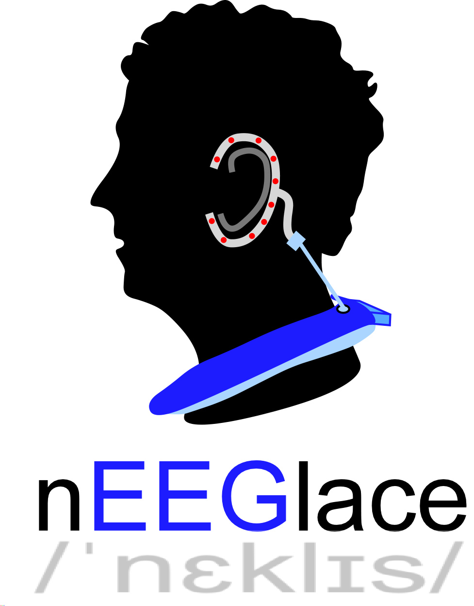

## nEEGlace
This is the project repository for the: **nEEGlace - a mounting system for EEG hardware for mobile ear-EEG recordings**

The nEEGlace is a system to record brain activity from electrodes located around the ears (cEEGrids). It is a combination of a commercial, research-grade EEG amplifier and a commercial neck speaker.  The system allows to conveniently record EEG over extended periods, and to play back sounds (e.g. for conducting studies in the field of auditory neuroscience).

Hardware:   

| nEEGlace |
|--------|
|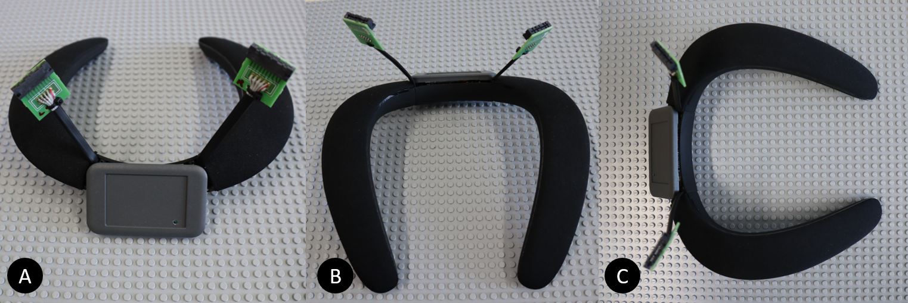*The nEEGlace for beyond the lab ear-EEG recordings*|

## Before you Start
Before you start, read carefully through the entire document.  Be aware that you will lose all manufacturer warranty if you modify the devices as described below. 

As also stated in the [SMARTING User Manual](https://mbraintrain.com/wp-content/uploads/2016/08/SMARTING-User-Manual.pdf): Do not use the amplifier (i.e. the nEEGlace) while charging! 

## Components
* Neckspeaker - JBL Soundgear BTA [https://www.jbl.com/bluetooth-speakers/JBL+SOUNDGEAR+BTA.html](https://www.jbl.com/bluetooth-speakers/JBL+SOUNDGEAR+BTA.html)
* Smarting EEG Amplifier [https://mbraintrain.com/smarting/](https://mbraintrain.com/smarting/)
* cEEGrid Connectors [https://ceegrid.com/how-to-connect](http://ceegrid.com/home/how-to-connect/)
* Female Jack Plug Socket

The cEEGrid is intended to be used with cEEGrids the are available for example [here](https://shop.tmsi.com/product/ceegrid).

## The Neck Speaker
The neck speaker serves primarily as a comfortable to wear mount for the 
amplifier and the connectors. In addition to that, it allows to play and record sound. 
The original Bluetooth functionality and any control functionality of the neck speaker is lost, as all active electronic components are removed from the neck speaker. The amplifier is positioned where the battery of the neck speaker was. 

## Disassemble Neck Speaker 
*  Remove mesh (A): The mesh material is clicked on the plastic part. The mesh material can be removed using a thin blade to lift it from the body. 
*  Unbolt all screws (B).
*  Remove the  metal plate in the middle (C).
*  Carefully lift the left part of the body (D). There is black glue at several locations,  remove carefully. 
*  Carefully lift the right part (E). The only thing that keeps the top part and body together is the micro USB connector.
*  Unbolt the screw (F).
*  Top (G-H) and bottom (I) parts are now detached from each other.

| Disassembly of Neck Speaker |
|--------|
|*Disassembly of neck speaker (A-I)*|

### Cut the Mesh

* Cut the mesh at the flexible joints (A - B).
* The center part is not needed and is left open for the amplifier (C).

| Mesh preparation |
|--------|
|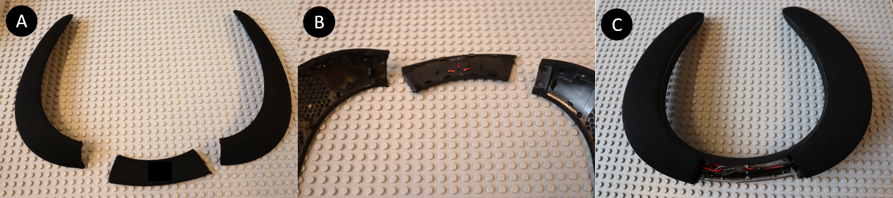*Mesh preparation (A-C)*|

## Disassemble Amplifier 
* Remove the four grey plastic covers at the backside of the amplifier. 
* Unbolt the four screws at the backside of the amplifier. 
* Lift the backside from the amplifier. You find the amplifier board, the lithium battery and the connector (A). 
* Lift the amplifier out of the plastic casing (B).

`!!Do this at your own risk! If you do this, you will lose all manufacturer warranty! This may destroy your amplifier! The authors of this article are not responsible for any potential damage!`

* Before you unsolder the battery and the connector cable make sure that you know your channel layout.
* Unsolder the battery and the connector cable (C).

| Disassembly of Amplifier |
|--------|
|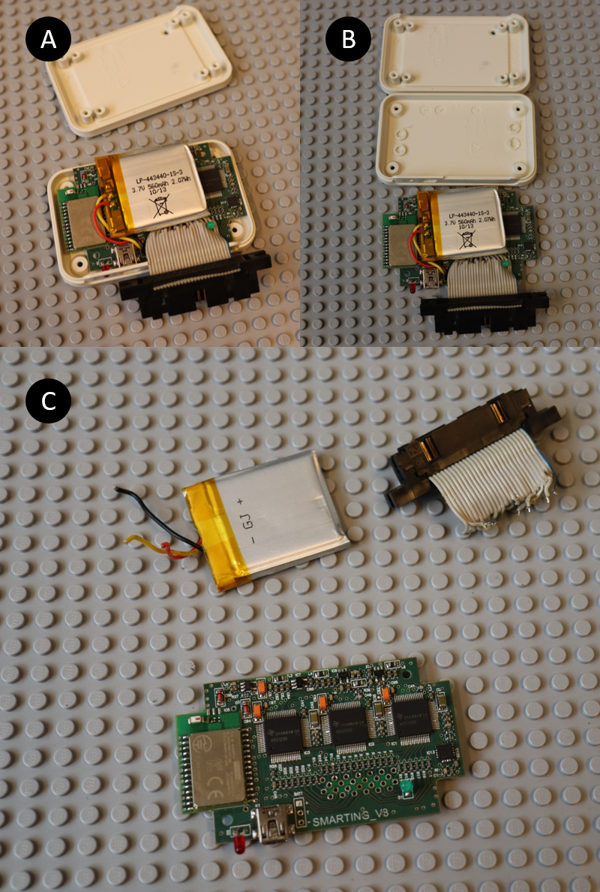*Disassembly of amplifier (A-C)*|

## Making Room for Amplifier Casing
The amplifier will be placed in the center of the neck speaker (I, silver), where the batteries were located.
To make room for the amplifier casing, part of the neck speaker casing needs to be removed.
For this, we used a rotary power tool (Dremel). 

* Push the board as far as possible to the front edge of the neck piece (A, red arrow).
* Mark the left and right side. Add .5 cm on each side for the casing. 
* Mark the area you want to cut out (B-D).

| Prepare Casing |
|--------|
|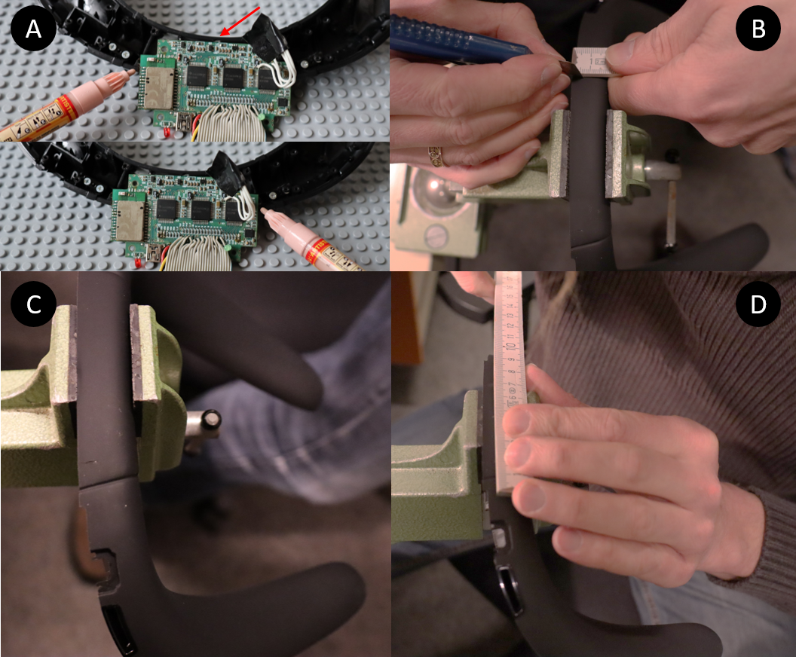*Preparing casing. Make room for the amplifier, A) The amplifier board needs to fit. Push the board as far as possible to the front edge of the neck piece (red) arrow. Mark the left and right side. Add .5 cm on each side for the casing. B-D) Mark the area you want to cut out.*|

| Cut casing |
|--------|
|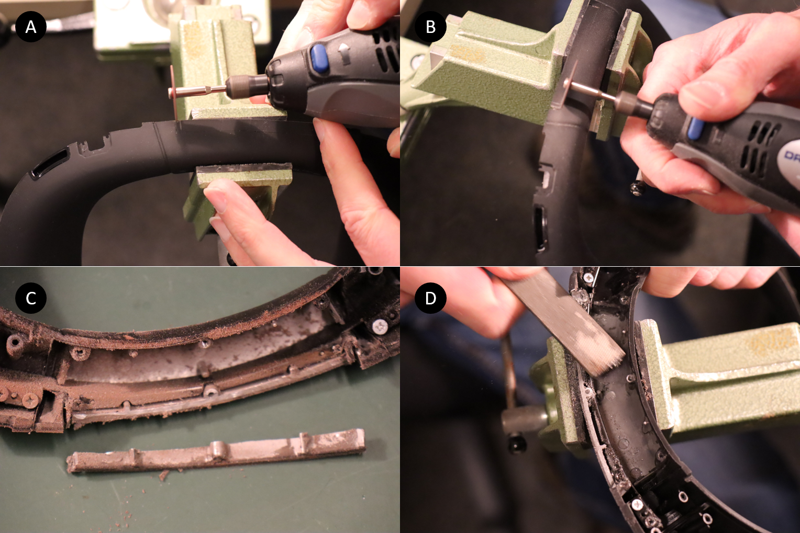*Make vertical (A) and horizontal (B) cuts into the aluminum. Make sure to remove all cutting residuals (C) and clean the cutting edge (D).*|

* Make vertical (A) and horizontal (B) cuts into the aluminum. Make sure that you do not cut into the metal clasp (C).
* Remove all metal and rubber shavings (C).
* Clean the cutting edge (D) and remove again all metal shavings.
* The result is shown in figure X (A). 

## Adjust Amplifier Casing
The lower part of the amplifier will be glued to the 
neck speaker and needs to be adapted to follow the curvature of the neck speaker.
This part of the amplifier casing and the neck speaker should be large enough to fit the amplifier board. 
* Mark the curvature of the neck speaker on the amplifier casing (B-C).
* Cut the amplifier with rotary power tool (D).
* The part of the casing marked here with an white X (E) can be discarded.
* There are a couple of plastic parts, inside the amplifier casing that need to be removed (F).

| Adjust  Amplifier Casing|
|--------|
|*Adjust the amplifier casing*|

## Combine Amplifier Casing and Neck Speaker Casing
The amplifier casing is glued onto the neck speaker. 
* Remove all residual rubber  (A) to expose the bare metal (B).
* Put the neck piece a bit higher (C).
* Place the amplifier casing at the corresponding location.
* Place something behind the casing to keep it in place.
* Glue the casing with 2-components Epoxy glue https://www.uhu.com/en/product-page.5485
* Let dry for at least 12 hours. 
* Turn the neck piece over and add another stripe of glue on the backside. 

| Add Casing|
|--------|
|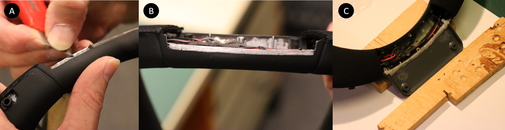*Add casing*|

## Adding the Jack Plug Socket
The neck speaker comes with Bluetooth. As the smarting amplifier communicates 
with Bluetooth as well, and as two Bluetooth connecting to a single devices are 
not possible, the neck speakers Bluetooth capabilities are removed.  
Furthermore, we had to remove the battery of the neck speaker to make room for 
the amplifier. To still be able to use the speaker and microphone functionality 
we added a jack plug socket.

### Making Room for the Jack Plug Socket
The jack plug socket goes where the neck speakers micro USB connector was. 
The area is large enough for a jack plug socket if you make the hole a bit larger (see pictures). 

* Remove the part of the plastic as indicated on (A) with pliers (B).
* The resulting hole (C) is just large enough to put the jack plug socket in (D), for a snug fit.

| Making Room for Jack Plug Socket|
|--------|
|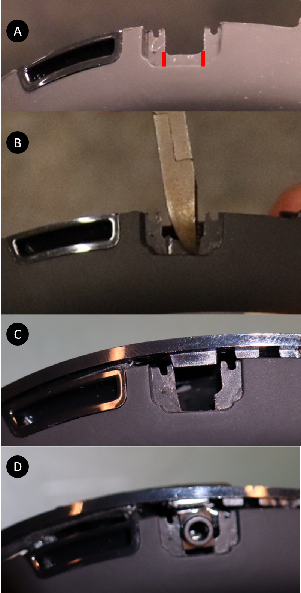*Making room for jackplug*|

### Remove Original Wiring of Neck Speaker
* Remove all glue and foamed material (A - B).
* Remove control unit (C).
* Remove microphone (grey cable) on the right side (D).
* Cut speaker cable on the right side (E - F).
* Remove everything but the speakers and the respective cabling from the neck piece (G).
* View from below (H) and from above (I). Left and right side are not connected. 
* We end up with a red/black cable for the speakers and a grey cable for the microphone. 

| Remove Wiring|
|--------|
|*Remove wiring*|

### Connecting the Jack Plug Socket
* Prepare the speaker cable to connect to the jack plug socket and solder them like in the following picture:

### Prepare cEEGrid connectors
The cEEGrid connector has been designed to fit into mini edge card sockets as 
offered by [SAMTEC (MB1-120-01-L-S-01-SL-N)](https://www.samtec.com/products/mb1). 
In combination with a small proprietary printed circuit board (PCB, shown below), 
a flat-ribbon cable and touch-proof (or similar) connectors, cEEGrids can be 
connected to most available EEG systems. To facilitate soldering and lower the 
risk of bridges we recommend removing every second pin before assembling the connector. 
Beginning with Pin 1, you have to remove every 2nd pin from the connector (see below).

If you want to produce or modify our connector, visit the fritzing website. 
[Download this file](http://ceegrid.com/download/smarting%20mit%20logo.fzz) for printing the PCB there. Alternatively, you can find the PCB desings [here](./cEEGrid-Adapter) as Gerber file. 

| Prepare Connectors|
|--------|
|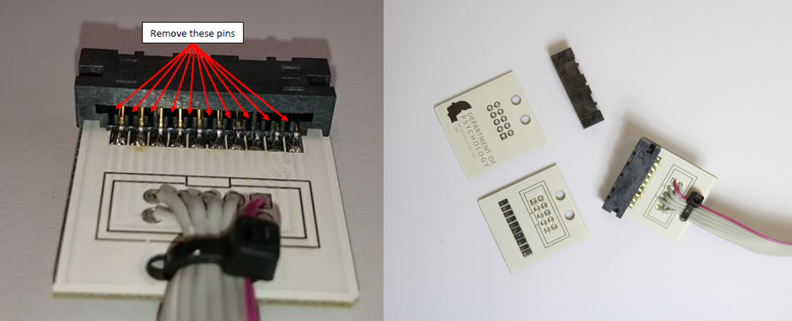*Left: to lower the risk of bridges between channels, we recommend removing every second pin before assembling the conector. Right: The PCB and mini card sockets before and after assembly.*|

| Soldering Instruction|
|--------|
|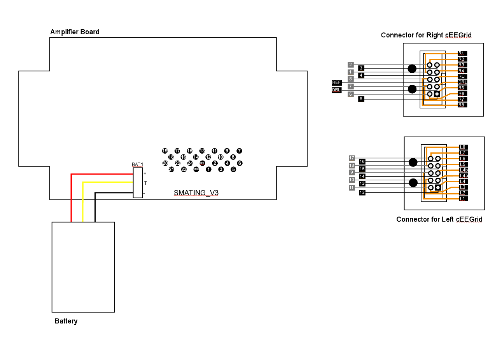*Schematic of channel configuration of amplifier board and cEEGrid connectors. Mark that the connectors for the left cEEGrid and right cEEGrid connector are inverted. The schematic for connecting amplifier and connectors can be found [here](./img/Soldering_Connectors.pdf)*|

* In our setup, channels R04a and R04b (i.e. right cEEGrid) serve as REF and DRL electrodes, respectively (in general you are free to choose the location of REF and DRL)

### Solder Connectors onto Amplifier. 
The connector cables can be soldered onto either the front or the back of PCB board of the amplifier. 
When you buy the smarting amplifier, the connector cables are on top. We place the cables from below. 
This allows us to position the cables in the neck piece. The pin arrangement of the amplifier can also be found in the [SMARTING User Manual](https://mbraintrain.com/wp-content/uploads/2016/08/SMARTING-User-Manual.pdf). 

* The connector cable should be about 5 cm long (A).
* The cables are connected on the backside (B, bottom). 
* The battery will remain on the front (B, top).
* Place the newly connected amplifier into the casing (C).
* Place the amp cover (D), and screw it on with the original screws (D).

| Add Connectors|
|--------|
|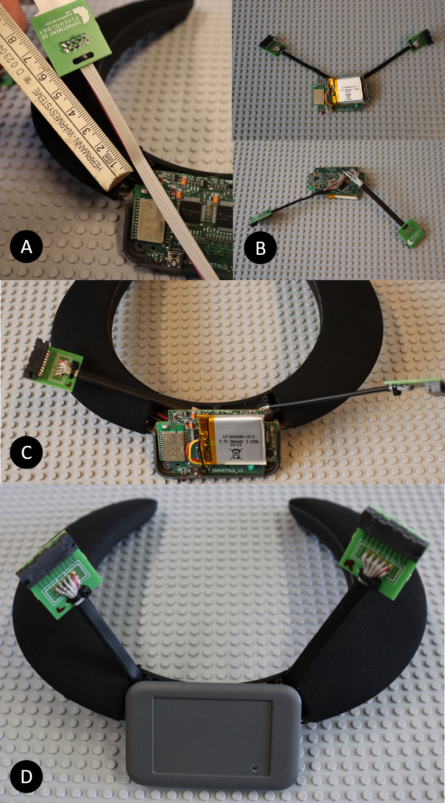*Added cEEGrid connectors*|

